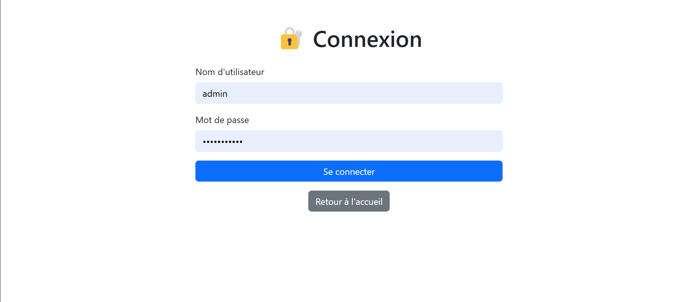
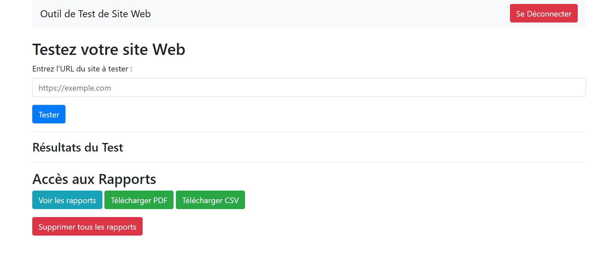
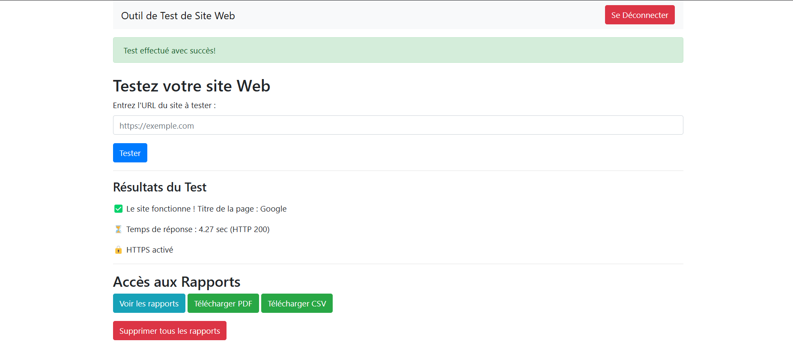
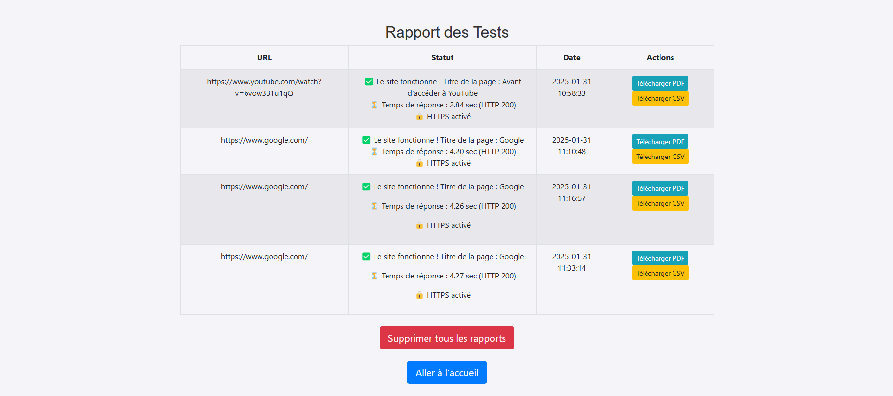

Voici un développement détaillé des améliorations possibles pour le projet :  

---

# **7. Améliorations Possibles en Détail**  

## **1️⃣ Ajouter un Système d’Authentification (Connexion Utilisateur) 🔐**  
### **Pourquoi ?**  
Actuellement, tout utilisateur peut accéder à l’application et consulter les tests effectués. Ajouter un système d’authentification permettrait de :  
✔️ Restreindre l’accès aux tests et rapports.  
✔️ Permettre à plusieurs utilisateurs d’utiliser l’application avec un compte personnel.  
✔️ Ajouter des fonctionnalités avancées comme un historique personnel des tests.  

### **Comment ?**  
- Utiliser **Flask-Login** pour gérer l’authentification.  
- Stocker les utilisateurs avec **SQLAlchemy** (ajout d’une table `User`).  
- Sécuriser les mots de passe avec **Werkzeug Security** (hachage de mots de passe).  

### **Exemple de Code :**  
#### **Modèle User (Base de Données)**
```python
from flask_login import UserMixin
from werkzeug.security import generate_password_hash, check_password_hash

class User(db.Model, UserMixin):
    id = db.Column(db.Integer, primary_key=True)
    username = db.Column(db.String(150), unique=True, nullable=False)
    password_hash = db.Column(db.String(256), nullable=False)

    def set_password(self, password):
        self.password_hash = generate_password_hash(password)

    def check_password(self, password):
        return check_password_hash(self.password_hash, password)
```

#### **Routes Flask pour l’Authentification**
```python
from flask_login import LoginManager, login_user, login_required, logout_user, current_user

login_manager = LoginManager()
login_manager.init_app(app)

@login_manager.user_loader
def load_user(user_id):
    return User.query.get(int(user_id))

@app.route('/login', methods=['GET', 'POST'])
def login():
    if request.method == 'POST':
        user = User.query.filter_by(username=request.form['username']).first()
        if user and user.check_password(request.form['password']):
            login_user(user)
            return redirect(url_for('dashboard'))
    return render_template('login.html')

@app.route('/logout')
@login_required
def logout():
    logout_user()
    return redirect(url_for('login'))
```

💡 **Avantage** : L’application devient plus sécurisée et chaque utilisateur peut gérer ses propres tests.  

---

## **2️⃣ Améliorer l’Interface avec Bootstrap 🎨**  
### **Pourquoi ?**  
Actuellement, l’interface est basique. Utiliser **Bootstrap** améliore :  
✔️ L’esthétique (design plus moderne et professionnel).  
✔️ La responsivité (adaptation aux mobiles et tablettes).  
✔️ L’ergonomie (meilleure expérience utilisateur).  

### **Comment ?**  
1. Ajouter Bootstrap dans le fichier HTML :  
```html
<head>
    <link rel="stylesheet" href="https://cdn.jsdelivr.net/npm/bootstrap@5.3.0/dist/css/bootstrap.min.css">
</head>
```
2. Modifier l’affichage des tests avec des **cards Bootstrap** :  
```html
<div class="container">
    <div class="card mt-3">
        <div class="card-body">
            <h5 class="card-title">Résultat du Test</h5>
            <p class="card-text">{{ status }}</p>
        </div>
    </div>
</div>
```
3. Ajouter un **bouton moderne** pour tester une URL :  
```html
<button class="btn btn-primary">Lancer le Test</button>
```
💡 **Avantage** : L’application devient plus agréable à utiliser avec un design professionnel.  

---

## **3️⃣ Exporter les Rapports en Excel 📊**  
### **Pourquoi ?**  
Le PDF est bien pour les rapports statiques, mais **un fichier Excel permet une analyse plus avancée**.  
✔️ Tri et filtrage des résultats.  
✔️ Graphiques et statistiques sur les performances des sites testés.  

### **Comment ?**  
Utiliser **pandas et openpyxl** pour générer un fichier `.xlsx`.  
#### **Installation des dépendances**
```sh
pip install pandas openpyxl
```
#### **Code pour Générer un Fichier Excel**
```python
import pandas as pd

@app.route('/download_excel')
def download_excel():
    results = TestResult.query.all()
    data = [{'URL': r.url, 'Statut': r.status, 'Date': r.timestamp} for r in results]
    
    df = pd.DataFrame(data)
    excel_file = BytesIO()
    with pd.ExcelWriter(excel_file, engine='openpyxl') as writer:
        df.to_excel(writer, index=False, sheet_name="Tests")
    
    excel_file.seek(0)
    return send_file(excel_file, as_attachment=True, download_name="rapport_tests.xlsx", mimetype="application/vnd.openxmlformats-officedocument.spreadsheetml.sheet")
```
💡 **Avantage** : Possibilité de **manipuler les données facilement** et d’effectuer des **analyses avancées**.  

---

## **4️⃣ Intégrer un Analyseur SEO 🔍**  
### **Pourquoi ?**  
Un test basique ne suffit pas toujours. **Un outil SEO permet d’évaluer la qualité du site** :  
✔️ Vérification des **balises meta** (description, titre).  
✔️ Analyse du **temps de chargement**.  
✔️ Détection des **liens cassés**.  

### **Comment ?**  
Utiliser **BeautifulSoup** pour analyser le contenu HTML :  
```sh
pip install beautifulsoup4
```
#### **Code pour Extraire les Meta-Descriptions**
```python
from bs4 import BeautifulSoup

def analyze_seo(url):
    try:
        response = requests.get(url)
        soup = BeautifulSoup(response.text, 'html.parser')
        
        # Récupérer le titre et la meta description
        title = soup.title.string if soup.title else "Titre non trouvé"
        meta_desc = soup.find("meta", attrs={"name": "description"})
        meta_desc_content = meta_desc["content"] if meta_desc else "Meta description non trouvée"
        
        return f"Titre: {title}\nDescription: {meta_desc_content}"
    except:
        return "Erreur lors de l'analyse SEO."
```
💡 **Avantage** : Obtenir des **informations utiles** pour améliorer le référencement du site testé.  

---

## **5️⃣ Ajouter une API REST pour l’Automatisation ⚡**  
### **Pourquoi ?**  
Une API permettrait d’intégrer ce testeur dans d’autres outils ou scripts.  
✔️ Automatiser les tests via des requêtes HTTP.  
✔️ Intégration avec des **tableaux de bord externes**.  

### **Comment ?**  
Ajouter des routes **JSON** dans Flask pour permettre l’accès aux résultats via une API.  
#### **Exemple d’Endpoint REST**
```python
from flask import jsonify

@app.route('/api/tests', methods=['GET'])
def api_tests():
    results = TestResult.query.all()
    return jsonify([{"url": r.url, "status": r.status, "timestamp": r.timestamp} for r in results])
```
💡 **Avantage** : Permet d’intégrer le projet avec d’autres **applications externes** ou un **bot d’analyse**.  

---

# **Conclusion 🚀**  
Ces améliorations rendraient l’application **plus puissante, sécurisée et complète** :  
✔️ **Authentification** → Sécurisation des données.  
✔️ **Design amélioré** → Expérience utilisateur optimale.  
✔️ **Export Excel** → Analyse avancée des résultats.  
✔️ **SEO Analyzer** → Vérification automatique du référencement.  
✔️ **API REST** → Intégration avec d’autres outils.  

**👉 Quelle amélioration souhaitez-vous implémenter en premier ?** 😃
*********************



